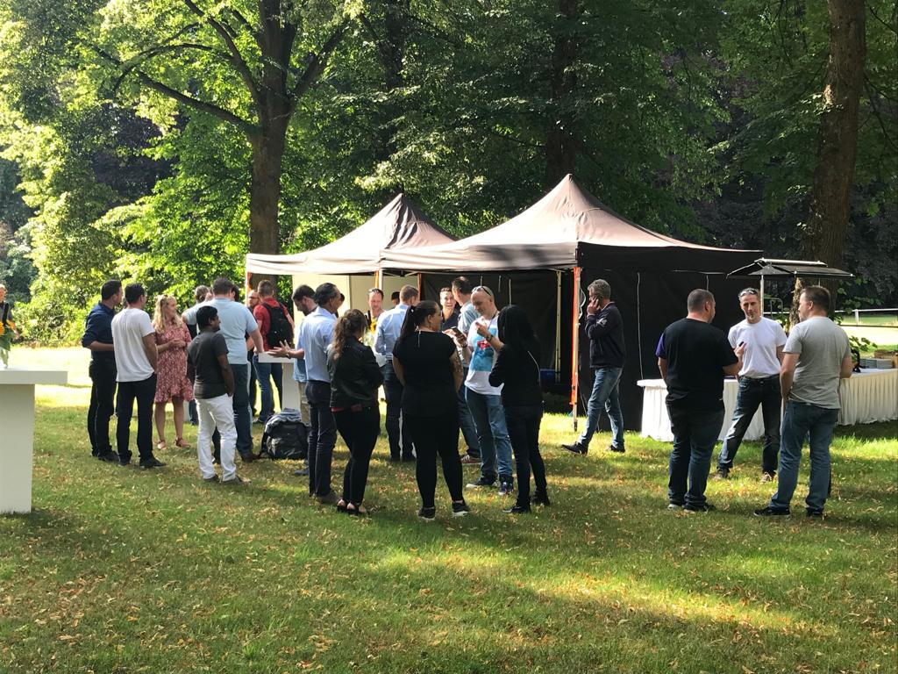

**Hands-On or Handcuffed: An Engineer's Choice**

Recently, a Zabbix cluster with MariaDB/Galera went down. My first instinct? Dive in and fix it immediately. My second “instinct”? Head to a customer site to deliver a cluster under tight constraints, not because it was my area of expertise, but because of promises that had been over‑committed. Technically, it could be made to work, but someone had to step in and clean up the mess. I reluctantly went. The work could be done, of course, but only by someone willing to take ownership when things went off the rails. One engineer, two conflicting imperatives: real problem-solving versus forced obligations.

My commitment isn’t a 9-to-5 attitude; it’s an ethos. I am 24/7 online, literally carrying redundant infrastructure in my vehicle: a fully charged Surface Pro 6 emergency laptop in the center console, running on built-in 5G/WiFi (nonnegotiable). At home, I run redundant laptops, Arch Linux daily and FreeBSD as backup, over two separate internet connections. This is how I operate. This is how I take responsibility. When a system crashes, I’m ready.

The result of being sent to the client? I set up a lifeline for the downed Zabbix cluster. I onboarded a colleague and an external consultant, whose specialized knowledge and no-nonsense mentality aligned with mine. I guided them step-by-step via Android Auto/carkit during the 1.5-hour drive until Zabbix was back online. System saved. Mission accomplished.

And yet, I hated it. The infrastructure and its Zabbix cluster is my 'baby': it demands intimate knowledge of MariaDB, Galera, and the full stack. Normally, I wouldn’t tolerate anyone else touching it. I was a distant lifeline, while the hierarchy dictated I should be elsewhere. I hated every minute I wasn’t at the keyboard.

This wasn’t just frustration. I formally filed an objection against the role distribution and the decision to prioritize sales over core technical accountability. Management made their choice, but the line had been crossed, personally and professionally.

### Politics vs. Code

But that’s the crux of it: engineering integrity doesn’t always fit neatly into corporate hierarchy.

I am not a checklist-clipper. I am not a man of corporate obligation. My motivation is technology, freedom to build and secure; principles clashing daily with the new direction.

Since a big megacorp took over, our lean MSP became a small cog in their massive bureaucratic wheel. The focus shifted to the public sector—governments, semi-governments, and the rule-enforcers who thrive on control.

Management now seems to think anyone can maintain the platform. Give the guy a Zabbix training and apparently a monkey can run it. Sure,have fun rebuilding Galera with your monkey when replication breaks at 3 a.m. (No offense Bas 😏)

I was the semi-reluctant CISO. Pushed into this role as the only one with a security focus, I handled ISO 27001 audits while running infrastructure and even earned compliments from auditors.

But I detested the clumsy bureaucracy it represented. While Big Corp has since taken over the CISO role, returning me to my place as an Admin/Engineer, it has only traded one set of frustrations for another. The corporate machine brings its own chains, a 'peeping tom' on the keyboard that clashes with the very freedom I fight for.

**My systems are engineered, not bought.** Everything runs on Debian (CIS hardened 95%+ via my custom Ansible roles). I refuse Red Hat standards because I choose technical excellence over vendor lock-in. I carry the flag for freedom. I run Arch Linux and FreeBSD on my machines. I am a nerd, a techie, a freedom fighter. I hate golden handcuffs.

The path higher management is paving isn’t the one I want to walk. More bureaucracy, more ‘client-over-tech’, in sectors I have no passion for, pulls me away from my craft. It’s a world away from the old days. Back then, it was "work hard, play hard." Technology was fun. We had pizza parties and late-night tech sessions. Now, it’s rosters, administration, and the relentless ticking clock of *factureerbare uren* (billable hours). The passion is being replaced by process.

We went from an old villa with rustic feelings, where large groups of nerds teamed up for BBQs with fifty Linux nerds minimum, hacking on projects together, to corporate office gardens with no one in sight. Now? The entire company counts maybe three Linux engineers. The culture that once built everything from scratch is gone, replaced by procedures, tickets, and “resources.”

### Choosing Freedom

This drive to take responsibility isn't confined to my corporate life. It's the same impulse that led me to serve as a Veteran and compels me to volunteer today, as a sports fishing controller and with the Veteran Search Team. These roles all stem from the same core identity: builder, protector, hands-on fixer. That is simply who I am.

A reminder to myself and to everyone in tech: know what you stand for.

Refuse the golden handcuffs. Stop seeing yourself as a resource on a spreadsheet or a cog in the corporate machine. Reclaim your identity as a builder, a fixer, and a problem-solver. Choose to be hands-on, not handcuffed.

> Freedom isn’t about working without rules. It’s about building without fear.